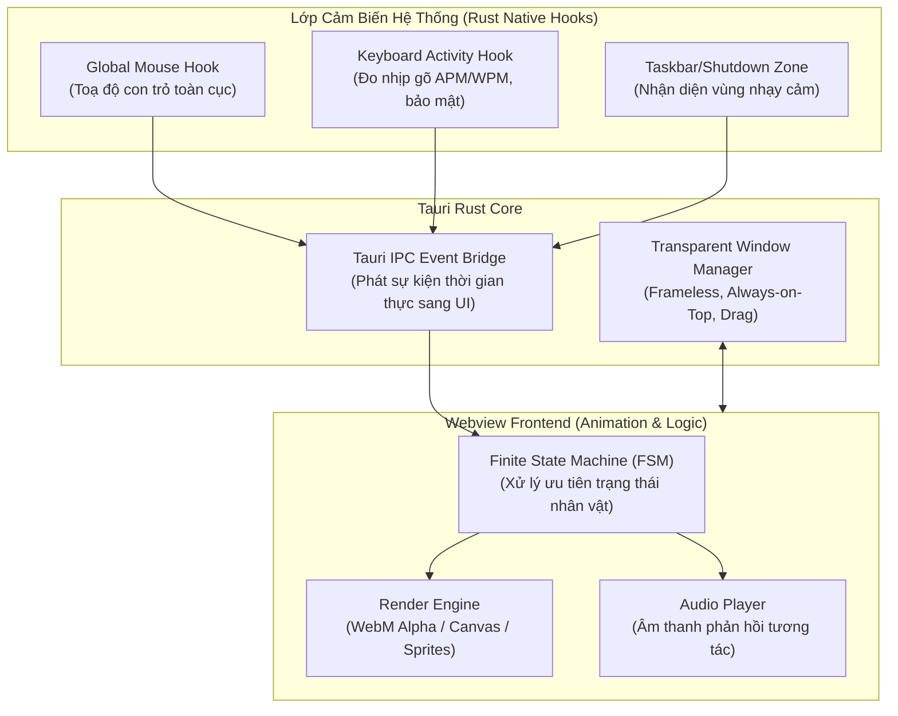

# Tài Liệu Thiết Kế Sản Phẩm: Anima Engine
*(Interactive Desktop Mascot Platform)*

---

## 1. Tầm Nhìn & Mục Tiêu Sản Phẩm (Vision & Goals)

### 1.1. Tầm nhìn
**Anima Engine** là một phần mềm trang trí desktop (Desktop Pet / Interactive Mascot) thế hệ mới dành cho Windows. Ứng dụng đưa các nhân vật chibi anime "sống động" lên màn hình với khả năng nhận biết và phản xạ thông minh theo hành vi thời gian thực của người dùng, mang lại cảm giác đồng hành vui vẻ trong khi học tập và làm việc.

### 1.2. Mục tiêu cốt lõi
* **Trải nghiệm sống động:** Phản ứng mượt mà theo thao tác chuột, tốc độ gõ phím và các sự kiện hệ thống (như di chuột vào nút Shutdown).
* **Siêu nhẹ & Tiết kiệm tài nguyên:** Chạy nền liên tục mà không gây giật lag hay tụt FPS khi chơi game/làm việc nặng (Mục tiêu: **RAM < 40MB, CPU < 0.5% khi idle**).
* **Thân thiện với Custom/Modding:** Dễ dàng cho người dùng và cộng đồng tự thêm nhân vật chibi của riêng mình mà không cần can thiệp mã nguồn.
* **Tôn trọng quyền riêng tư:** Các cảm biến hành vi (như đo nhịp gõ phím) chỉ tính toán tần suất cục bộ, **tuyệt đối không ghi lại nội dung văn bản (No Keylogger)**.

---

## 2. Kiến Trúc Hệ Thống Tổng Thể (System Architecture)

Dự án áp dụng mô hình kiến trúc phân tầng kết hợp **Tauri (Rust)** và **Webview2 (Frontend Web Engine)**:



### Chi tiết các tầng:
1. **Lớp Native (Rust Backend):**
   * **Window Manager:** Tạo cửa sổ trong suốt không viền (frameless layered window), ghim trên cùng (`Always-on-Top`), hỗ trợ kéo thả mượt mà không delay.
   * **Sensors (Cảm biến OS):** Lắng nghe vị trí chuột và nhịp độ gõ phím qua API mức thấp của Windows (`Win32 API`) với độ trễ gần như bằng 0 và tiêu hao CPU tối thiểu.
2. **Lớp Cầu Nối Sự Kiện (Tauri IPC Event Bridge):**
   * Truyền phát các sự kiện (`mouse-move`, `typing-burst`, `zone-alert`) từ Rust sang Frontend qua cơ chế Event Bus của Tauri.
3. **Lớp Hiển Thị & Trí Tuệ (Webview Frontend):**
   * **State Machine (FSM):** Quản lý chu trình trạng thái của Chibi (`Idle` ➔ `LookAtMouse` ➔ `Typing` ➔ `Panic` ➔ `Dragged`).
   * **Renderer:** Xử lý phát hoạt ảnh WebM trong suốt hoặc ảnh động/sprite với tốc độ 60fps sắc nét.

---

## 3. Các Chức Năng Chính (Core Feature Set)

### 3.1. Cửa Sổ Nổi Trong Suốt & Tương Tác Vật Lý (Window & Touch)
* **Hiển thị không viền:** Loại bỏ hoàn toàn viền cửa sổ chuẩn của Windows; chỉ có hình ảnh Chibi nổi tự do trên màn hình.
* **Kéo thả tự do (Drag & Drop):** Giữ chuột trái vào thân Chibi để bế/di chuyển đi khắp màn hình.
* **Tương tác trực tiếp:** Click chuột vào người để kích hoạt phản ứng ngượng ngùng / cười / phát âm thanh vui tai.
* **Menu chuột phải (Context Menu):** Menu ngữ cảnh tối giản để truy cập nhanh: Bật/Tắt âm thanh, Ẩn tạm thời, Thoát ứng dụng.

### 3.2. Bộ Hành Vi Tương Tác Cốt Lõi (Reactive Behaviors)

| Hành vi người dùng | Phản xạ của Chibi | Chi tiết kỹ thuật |
| :--- | :--- | :--- |
| **Nhìn theo chuột (Look-at-Cursor)** | Mắt hoặc đầu Chibi xoay hướng theo con trỏ chuột | Tính toán vector góc giữa toạ độ Chibi và con trỏ chuột, cập nhật góc quay mượt mà. |
| **Gõ phím liên tục (Typing Burst)** | Chibi hào hứng gõ bàn phím mini hoặc vẫy cờ cổ vũ | Kích hoạt khi nhịp gõ vượt ngưỡng (ví dụ: > 30 APM). Khi dừng gõ, chuyển về Idle sau 2-3s. |
| **Rê chuột vào nút Shutdown** | Chibi hoảng loạn, sợ hãi, khóc xin đừng tắt máy | Nhận diện con trỏ đi vào góc dưới bên trái (Start Menu / Taskbar Power Area). |
| **Bị nhấc kéo (Dragged)** | Chibi bị lơ lửng, hai chân đung đưa, biểu cảm bối rối | Kích hoạt ngay khi bắt đầu thao tác nhấn giữ chuột trái và kéo. |
| **Nhàn rỗi (Idle)** | Chớp mắt, thở nhẹ, thỉnh thoảng đổi tư thế | Hoạt ảnh lặp vô tận, xen kẽ các cử chỉ ngẫu nhiên sau mỗi 10-15 giây. |

---

## 4. Chiến Lược Dữ Liệu Nhân Vật (Character Pack Strategy)

Mỗi nhân vật được đóng gói dưới dạng một thư mục riêng biệt gồm asset hình ảnh/âm thanh và cấu hình định nghĩa:

```text
characters/
└── hina/                   <-- Nhân vật mặc định: Sorasaki Hina (Blue Archive)
    ├── manifest.json       <-- Khai báo thông tin, scale, mapping hoạt ảnh và âm thanh
    ├── preview.png         <-- Ảnh đại diện
    ├── audio/              <-- 40 file âm thanh lồng tiếng gốc từ F:\hina voice
    │   ├── Hina_Cafe_Act_1.ogg.mp3
    │   ├── Hina_Cafe_Act_2.ogg.mp3
    │   ├── Hina_Cafe_Act_3.ogg.mp3
    │   ├── Hina_Cafe_Act_4.ogg.mp3
    │   └── Hina_Cafe_Act_5.ogg.mp3
    └── animations/         <-- Hoạt ảnh trong suốt (Giai đoạn 1: 4 Sprite PNG / Giai đoạn 2: Spine 2D)
        ├── idle.png        <-- Đứng yên chắp tay sau lưng, mỉm cười nhẹ
        ├── typing.png      <-- Vỗ tay / cổ vũ hào hứng
        ├── panic.png       <-- Toát mồ hôi, mắt hoa tiêu hoảng sợ
        └── dragged.png     <-- Tư thế Cafe Picked-up bị nhấc bổng lơ lửng bằng chuột
```

* **Bản MVP (Giai đoạn 1):** Đi kèm **Sorasaki Hina (Blue Archive)** làm mascot chuẩn mực (Benchmark Mascot) với 4 sprite SD Cafe chính thức chuẩn 100% tư thế (đặc biệt là tư thế bị nhấc bổng `Cafe_Pick` kinh điển), tích hợp trọn bộ lồng tiếng Cafe có sẵn từ máy người dùng.
* **Bản nâng cấp (Giai đoạn 2):** Nạp trực tiếp bộ xương Spine 2D WebGL (`.skel`/`.json` + `.atlas`) của Hina để chuyển động 60 FPS toàn diện.

---

## 5. Lộ Trình Phát Triển Sản Phẩm (Product Roadmap)

### 📌 Giai đoạn 1: Bản MVP (Trọng tâm hiện tại)
* [x] Thống nhất tầm nhìn & tài liệu thiết kế sản phẩm.
* [ ] Thiết lập dự án Tauri (Rust + Webview2).
* [ ] Tạo cửa sổ trong suốt (Transparent, Frameless, Always-on-top, Drag-to-move).
* [ ] Viết Module Rust lắng nghe sự kiện chuột, nhịp gõ phím và góc màn hình.
* [ ] Tích hợp Chibi mặc định phản hồi 4 kịch bản hành vi chính.
* [ ] Viết unit test và kiểm thử độ ổn định (theo quy tắc `AGENTS.md`).

### 📌 Giai đoạn 2: Hệ Thống Tùy Biến (Custom & Modding Engine)
* [ ] Bộ nạp skin động (Dynamic Character Loader) đọc từ thư mục người dùng.
* [ ] Hỗ trợ tính năng nhìn theo chuột đa góc độ hoặc tròng mắt phân lớp (Layered Pupil).
* [ ] Hỗ trợ nhập gói nhân vật trực tiếp bằng file nén `.zip` / `.anima`.

### 📌 Giai đoạn 3: Trải Nghiệm & Tiện Ích Mở Rộng (UX & Desktop Companion)
* [ ] Khay hệ thống (System Tray) với biểu tượng ứng dụng.
* [ ] Giao diện Cài đặt (Settings UI) điều chỉnh tỉ lệ kích thước chibi, âm lượng, độ nhạy.
* [ ] Tiện ích mở rộng: Đồng hồ mini, báo giờ nghỉ ngơi (Pomodoro), nhắc nhở uống nước.

---

## 6. Tiêu Chuẩn Kỹ Thuật & Phi Chức Năng (Non-Functional Requirements)

1. **Hiệu năng:** RAM tối đa 40MB, CPU dưới 0.5% khi nhàn rỗi. Tự động tạm dừng hoạt ảnh nặng khi máy chạy tác vụ toàn màn hình (Game Fullscreen mode).
2. **Bảo mật:** Không truy xuất dữ liệu phím bấm của người dùng; chỉ tính xung nhịp gõ (keystroke ticks).
3. **Quy chuẩn chất lượng (theo AGENTS.md):**
   * Mọi cập nhật mã nguồn phải có commit Git tương ứng.
   * Viết test đầy đủ cho các module cảm biến và chuyển đổi trạng thái để đảm bảo sản phẩm hoạt động ổn định trước khi bàn giao.
