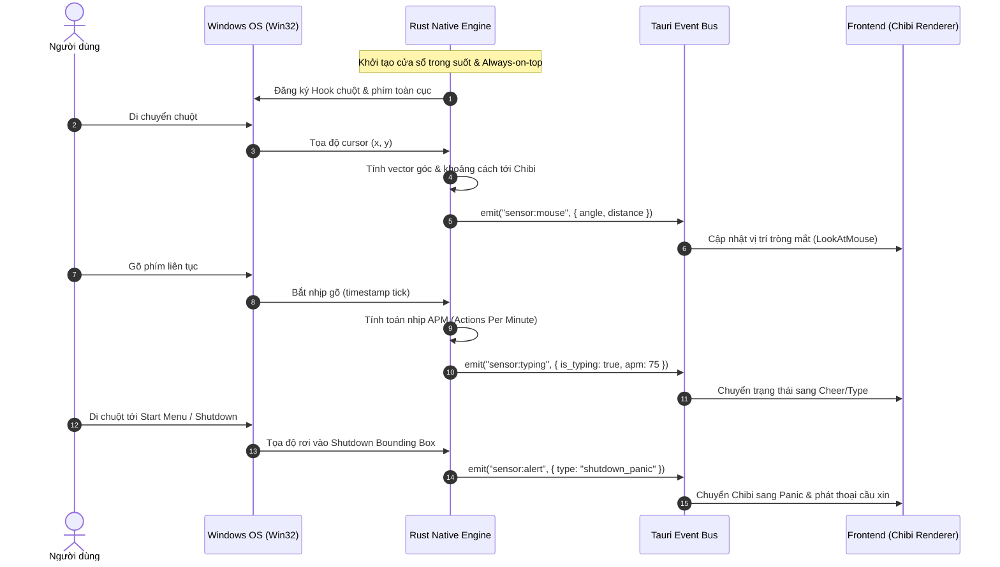
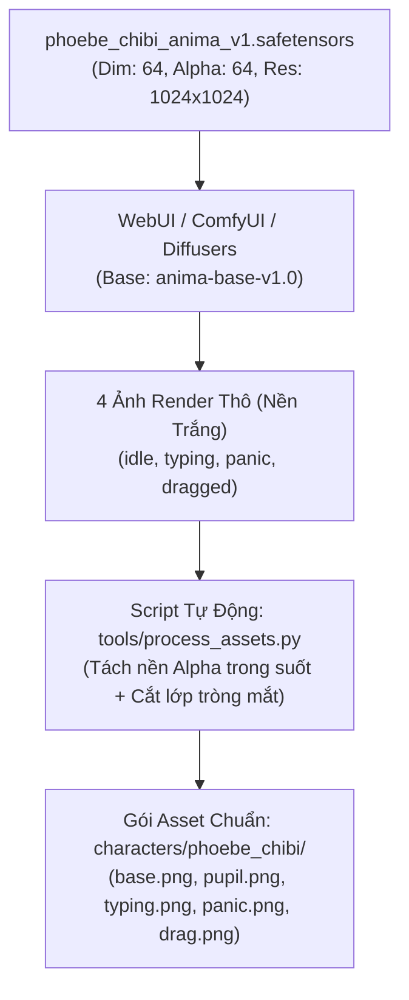

# Tài Liệu Phương Án Kỹ Thuật: Anima Engine
*(Tauri + Rust + Webview2 Desktop Mascot Architecture)*

---

## 1. Tổng Quan Kiến Trúc & Công Nghệ (Tech Stack)

Hệ thống được xây dựng trên nền tảng **Tauri 2.0**, phân tách rõ ràng giữa tầng **Native OS (Rust)** và tầng **Giao diện/Hoạt ảnh (Webview2)**:

| Thành phần | Công nghệ lựa chọn | Mục đích & Trách nhiệm |
| :--- | :--- | :--- |
| **Native Core** | **Rust (Tauri Core)** | Quản lý vòng đời ứng dụng, tạo cửa sổ trong suốt không viền, thiết lập Windows Hooks mức thấp, tính toán cảm biến và phát sự kiện IPC. |
| **OS Sensors** | **Windows API (`windows-rs` / `winapi`)** | Lắng nghe toạ độ chuột toàn cục, đo tần suất gõ phím (`WH_KEYBOARD_LL`), phát hiện vùng nguy hiểm (Taskbar/Shutdown). |
| **Frontend UI** | **HTML5 / TypeScript / Canvas** | Quản lý máy trạng thái nhân vật (FSM), bộ render hoạt ảnh WebM Alpha / Layered Eyes và hệ thống phát âm thanh. |
| **Giao thức IPC** | **Tauri Event System (`emit` / `listen`)** | Gửi tín hiệu cảm biến thời gian thực một chiều (Rust ➔ Frontend) với độ trễ < 2ms. |

---

## 2. Hướng Dẫn Chuẩn Bị Môi Trường Cài Đặt (Prerequisites Guide)

Để biên dịch ứng dụng Tauri trên Windows, máy tính của bạn cần cài đặt 3 công cụ sau:

### 🔹 Bước 1: Cài đặt Microsoft C++ Build Tools *(Bắt buộc cho Rust trên Windows)*
1. Truy cập: [Visual Studio C++ Build Tools](https://visualstudio.microsoft.com/visual-cpp-build-tools/)
2. Tải về và chạy file `vs_BuildTools.exe`.
3. Trong giao diện cài đặt, tích chọn duy nhất mục: **"Desktop development with C++"** (Phát triển ứng dụng máy tính để bàn bằng C++).
4. Nhấn **Install** (quá trình này sẽ tải và cài đặt compiler `MSVC cl.exe` và `Windows 10/11 SDK`).

### 🔹 Bước 2: Cài đặt Rust Toolchain
1. Truy cập: [rustup.rs](https://rustup.rs/)
2. Tải file `rustup-init.exe` (chọn bản 64-bit).
3. Chạy file và nhấn phím `1` (Proceed with installation - default).
4. Sau khi hoàn tất, mở PowerShell mới và kiểm tra:
   ```powershell
   rustc --version
   cargo --version
   ```

### 🔹 Bước 3: Cài đặt Node.js LTS
1. Truy cập: [nodejs.org](https://nodejs.org/) và tải bản **LTS (Long Term Support)**.
2. Hoặc nếu bạn muốn cài nhanh qua winget:
   ```powershell
   winget install OpenJS.NodeJS.LTS
   ```
3. Kiểm tra cài đặt thành công:
   ```powershell
   node --version
   npm --version
   ```

---

## 3. Thiết Kế Kỹ Thuật Chi Tiết (Detailed Technical Design)



### 3.1. Cấu hình Cửa sổ Nổi Trong suốt (Window Configuration)
Trong `tauri.conf.json`:
```json
{
  "app": {
    "windows": [
      {
        "title": "Anima Engine",
        "width": 300,
        "height": 350,
        "transparent": true,
        "decorations": false,
        "alwaysOnTop": true,
        "skipTaskbar": true,
        "shadow": false,
        "resizable": false
      }
    ]
  }
}
```
* **Kéo thả:** Tích hợp trực tiếp sự kiện `onMouseDown` ở thân Chibi gọi API `appWindow.startDragging()`.

---

### 3.2. Lớp Cảm Biến OS (Rust Native Sensor Subsystem)

#### a) Cảm biến Chuột (Mouse Tracker)
* Sử dụng luồng nền (background thread) định kỳ gọi `GetCursorPos` với tần số 30–60Hz (hoặc event-driven qua Hook).
* Tính vector toạ độ tương đối giữa tâm nhân vật $(X_c, Y_c)$ và vị trí chuột $(X_m, Y_m)$:
  $$\Delta x = X_m - X_c, \quad \Delta y = Y_m - Y_c$$
  $$\theta = \text{atan2}(\Delta y, \Delta x), \quad d = \sqrt{\Delta x^2 + \Delta y^2}$$
* Gửi dữ liệu góc $\theta$ và khoảng cách $d$ sang Webview để điều khiển chuyển động của tròng mắt.

#### b) Cảm biến Nhịp gõ phím (Typing APM Monitor - An toàn & Riêng tư)
* Đăng ký `SetWindowsHookExW(WH_KEYBOARD_LL, ...)`:
  * **Chỉ đếm xung nhịp (Tick counter):** Mỗi khi phím nhấn xuống, chỉ lưu thời điểm `Instant::now()`.
  * **Tuyệt đối không lưu lại mã phím (`vkCode`)**: Đảm bảo an toàn 100% không vi phạm chính sách bảo mật / Antivirus.
  * Tính toán chỉ số nhịp gõ (Rolling Window 2 giây): Nếu nhịp bấm $> 3$ lần/giây $\Rightarrow$ Phát sự kiện `TypingBurst`.

#### c) Nhận diện Vùng Cảnh báo (Shutdown / Start Detection)
* Đọc kích thước màn hình chính qua `GetSystemMetrics(SM_CYSCREEN)` và vị trí Taskbar.
* Bounding Box vùng Shutdown: Thường nằm ở toạ độ góc dưới bên trái màn hình:
  $$\text{Zone}_{\text{shutdown}} = \{ (x, y) \mid 0 \le x \le 80 \land (\text{ScreenHeight} - 60) \le y \le \text{ScreenHeight} \}$$
* Khi tọa độ chuột đi vào vùng này, kích hoạt trạng thái khẩn cấp `PANIC_SHUTDOWN`.

---

### 3.3. Cơ Chế Nhìn Theo Chuột của Chibi (Layered Pupil Tracking)
Để tạo hiệu ứng mắt liếc nhìn theo chuột 360 độ tự nhiên:
* **Asset gồm 2 lớp:**
  1. `base.png`: Khuôn mặt và thân Chibi Phoebe (vùng mắt đã được khoét rỗng lòng trắng).
  2. `pupil.png`: Cặp tròng mắt xanh/ngọc long lanh của Phoebe.
* **Công thức dịch chuyển tròng mắt (Offset Calculation):**
  * Giới hạn bán kính di chuyển tối đa: $R_{\text{max}} = 10\text{px}$.
  * Khoảng cách dịch chuyển thực tế:
    $$r_{\text{offset}} = \min(R_{\text{max}}, \frac{d}{50} \times R_{\text{max}})$$
  * Toạ độ dịch chuyển của tròng mắt:
    $$\text{offset}_X = r_{\text{offset}} \times \cos(\theta), \quad \text{offset}_Y = r_{\text{offset}} \times \sin(\theta)$$
  * Tròng mắt được dịch chuyển tức thì bằng CSS `transform: translate3d(offsetX, offsetY, 0)` tận dụng GPU acceleration.

---

### 3.4. Quản Lý Trạng Thái Nhân Vật (Finite State Machine - FSM)

Các trạng thái của Phoebe và thứ tự ưu tiên:
1. `DRAGGED` *(Ưu tiên 1 - Cao nhất)*: Đang bị kéo thả di chuyển.
2. `PANIC_SHUTDOWN` *(Ưu tiên 2)*: Chuột nằm trong vùng nút Shutdown/Start.
3. `TYPING` *(Ưu tiên 3)*: Người dùng đang gõ phím nhanh.
4. `LOOK_AT_MOUSE` *(Ưu tiên 4)*: Chuột đang di chuyển xung quanh Chibi.
5. `IDLE` *(Ưu tiên 5 - Mặc định)*: Trạng thái thở, chớp mắt nhẹ nhàng.

---

## 4. Đặc Tả Dữ Liệu Nhân Vật (Phoebe Manifest Schema)

Thư mục nhân vật mặc định: `characters/phoebe_chibi/manifest.json`:

```json
{
  "id": "phoebe_chibi",
  "name": "Phoebe (Wuthering Waves)",
  "version": "1.0.0",
  "author": "AnimaEngine",
  "scale": 1.0,
  
  "states": {
    "idle": {
      "asset": "animations/idle.webm",
      "loop": true
    },
    "typing": {
      "asset": "animations/typing.webm",
      "loop": true,
      "dialogues": ["Cố lên chủ nhân! (★ω★)", "Gõ phím siêu quá đi!"]
    },
    "panic_shutdown": {
      "asset": "animations/panic.webm",
      "sound": "audio/panic.mp3",
      "dialogues": ["Đừng tắt máy mà hu hu! (っ- ‸ - ς)", "Cho em chơi thêm xíu đi!"]
    },
    "dragged": {
      "asset": "animations/drag.webm",
      "sound": "audio/wobble.mp3"
    }
  },

  "eye_tracking": {
    "enabled": true,
    "base_sprite": "animations/eyes/base.png",
    "pupil_sprite": "animations/eyes/pupil.png",
    "pupil_anchor": { "x": 150, "y": 120 },
    "max_radius": 10
  }
}
```

## 5. Quy Trình Sản Xuất & Xử Lý Asset Từ LoRA (`phoebe_chibi_anima_v1.safetensors`)

Quy trình chuẩn để chuyển đổi từ mô hình AI sang asset game siêu nhẹ:



### 5.1. Thông số Cấu hình Render từ LoRA
* **Base Model:** `anima-base-v1.0.safetensors` (hoặc checkpoint Anime tương thích).
* **Độ phân giải:** $1024 \times 1024$ (tỉ lệ 1:1 chuẩn chibi).
* **LoRA Weight:** `0.8 - 1.0` (Trigger chính: `phoebe_chibi`).
* **Sampler:** DPM++ 2M Karras hoặc Euler a, Steps: 24–30, CFG Scale: 6.0–7.0.

### 5.2. Bộ Prompt Chuẩn Cho 4 Trạng Thái Cốt Lõi

1. **Trạng thái Nghỉ & Nhìn theo chuột (`idle.png`):**
   * **Positive:** `masterpiece, best quality, 1girl, phoebe_chibi, cute chibi emoji style, blonde bangs, white hat, blue cross hair clip, purple eyes, gentle smile, standing, simple white background`
   * **Negative:** `low quality, worst quality, blurry, text, watermark, realistic, 3d, complex background, dark background`

2. **Trạng thái Gõ phím / Cổ vũ (`typing.png`):**
   * **Positive:** `masterpiece, best quality, 1girl, phoebe_chibi, cute meme chibi style, bright white circular eye highlights, smug proud expression, cheering, raising hands, holding mini golden bell, simple white background`
   * **Negative:** `low quality, worst quality, complex background, text, cropped`

3. **Trạng thái Hoảng sợ khi chuột vào Shutdown (`panic.png`):**
   * **Positive:** `masterpiece, best quality, 1girl, phoebe_chibi, dazed confused pose, crying, teary purple eyes, opened mouth, raised inner eyebrows, waving hands, panic expression, simple white background`
   * **Negative:** `low quality, worst quality, complex background, smile, calm`

4. **Trạng thái Bị nhấc lơ lửng (`dragged.png`):**
   * **Positive:** `masterpiece, best quality, 1girl, phoebe_chibi, dangling pose, suspended in air, kicking legs, surprised pouty expression, flustered, simple white background`
   * **Negative:** `low quality, worst quality, standing on floor, complex background`

### 5.3. Kịch Bản Hậu Kỳ Tự Động (Post-Processing Pipeline)
Một script Python chuyên dụng (`tools/process_assets.py`) được xây dựng để thực hiện tự động:
1. **Chuyển đổi sang Transparent RGBA:** Loại bỏ nền trắng thành nền trong suốt hoàn hảo.
2. **Bóc tách tròng mắt cho tính năng Eye Tracking:**
   * Từ bức ảnh `idle.png`, xác định bounding box của 2 mắt.
   * Cắt rời cặp tròng mắt tím lưu thành `animations/eyes/pupil.png`.
   * Tô phủ lòng trắng / làm rỗng hốc mắt trên khuôn mặt gốc, lưu thành `animations/eyes/base.png`.
3. **Đồng bộ hóa vào Engine:** Tự động copy vào thư mục `characters/phoebe_chibi/` và cập nhật thông số `pupil_anchor` vào `manifest.json`.

---

## 6. Chiến Lược Kiểm Thử (Testing & Quality Assurance - Quy Tắc AGENTS.md)

1. **Rust Unit Tests (`cargo test`):**
   * `test_angle_and_distance_calculation`: Kiểm tra tính toán góc lượng giác và khoảng cách chuột.
   * `test_apm_calculator`: Kiểm tra thuật toán tính toán nhịp gõ phím và cơ chế reset cửa sổ trượt.
   * `test_shutdown_zone_detection`: Kiểm tra độ chính xác của vùng va chạm Shutdown.
2. **Frontend Tests:**
   * Kiểm thử tính toàn vẹn của file cấu hình `manifest.json`.
   * Kiểm thử chuyển đổi trạng thái FSM (State Transitions & Priority Queuing).
3. **Tiêu chuẩn nghiệm thu hiệu năng:**
   * Đo đạc mức chiếm dụng tài nguyên hệ thống qua Task Manager: **RAM < 40MB, CPU < 0.5% khi Idle**.
   * Đảm bảo không rò rỉ bộ nhớ (Memory Leak) sau 1 giờ chạy liên tục.

